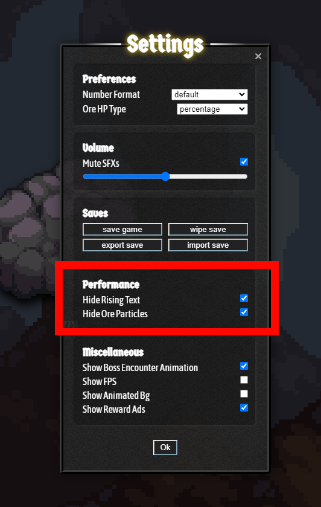

# Weak spot clicker 3000

"Cheat" for [More Ore](https://syns.studio/more-ore/)

Really just another distraction, it's not wild. It uses opencv to detect where on the screen the weak spot is, then clicks it. Repeat.

## How to run

````shell
python main.py
````

### Auto-click mode

In [main.py](main.py) add the following to the `abuse` function call.
````python
move_only=False
````

This will make the application automatically click instead of just moving the cursor

## Settings

To avoid detection issues you should make sure you have the following options enabled.



## Is it tested?

Tested it with around 2000 clicks without a single failure.
